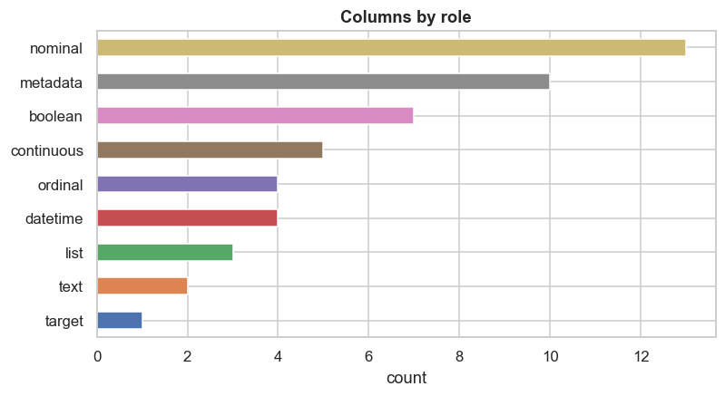
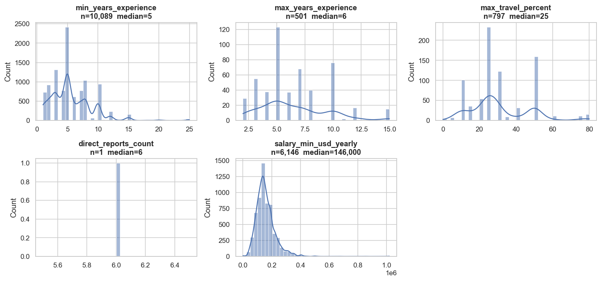
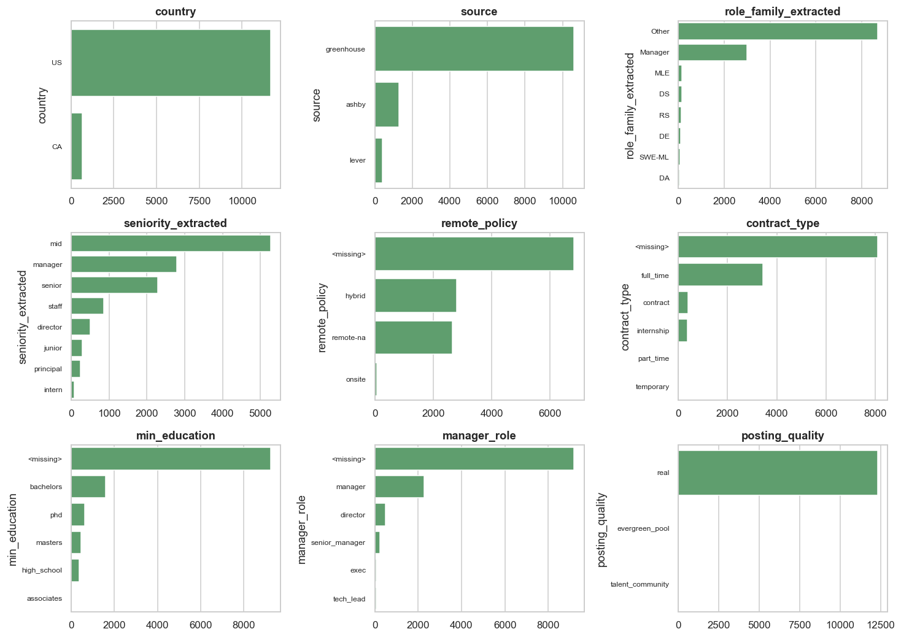
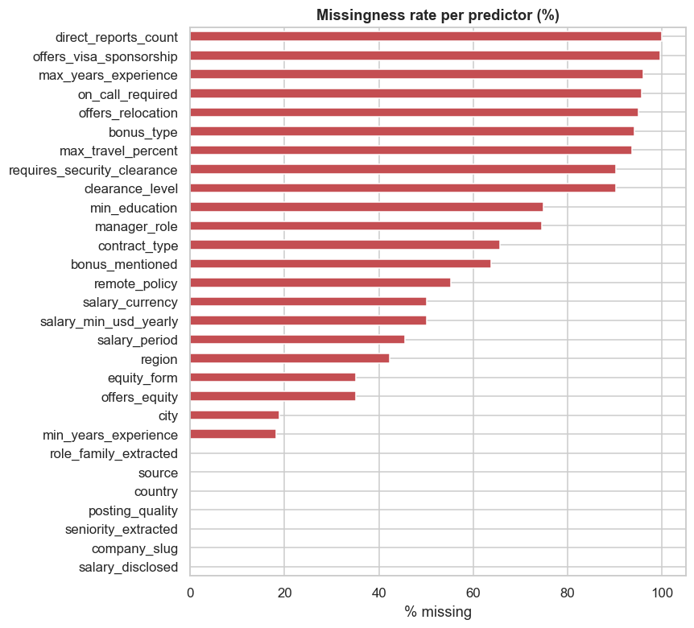
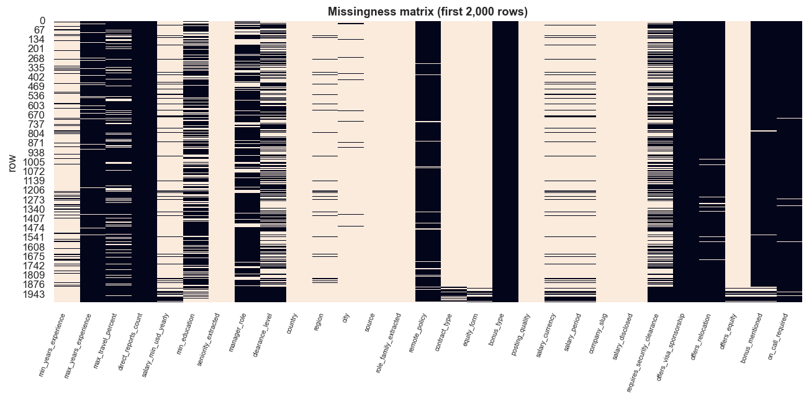
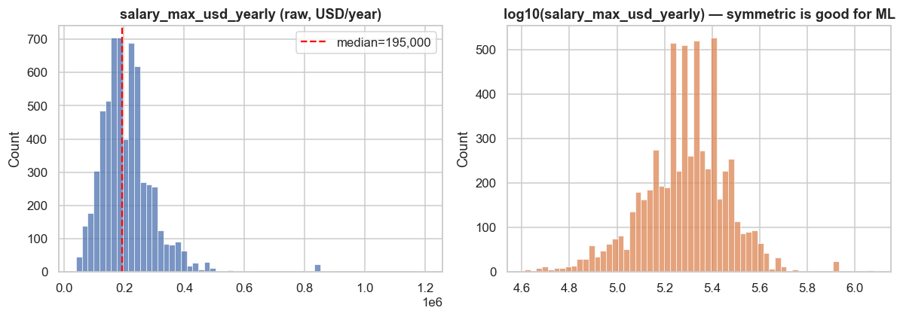
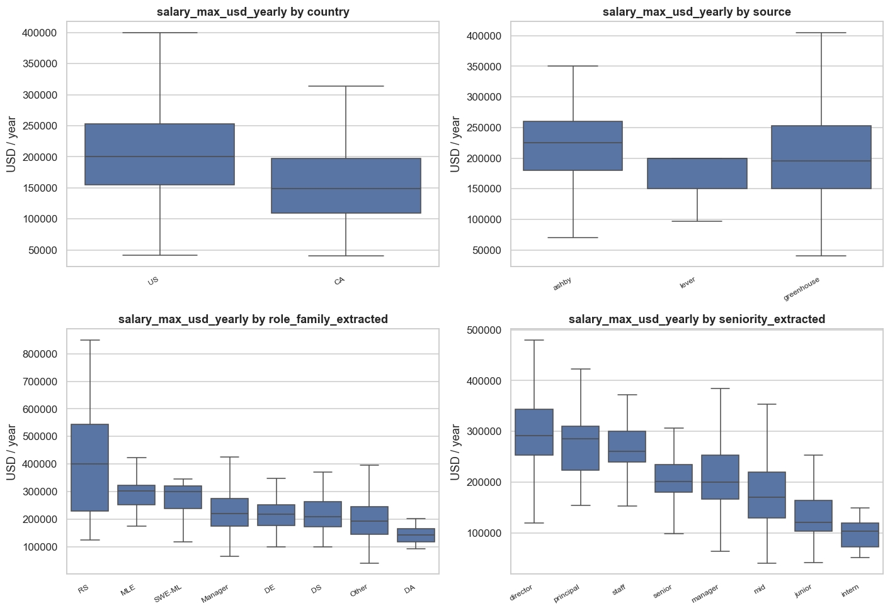
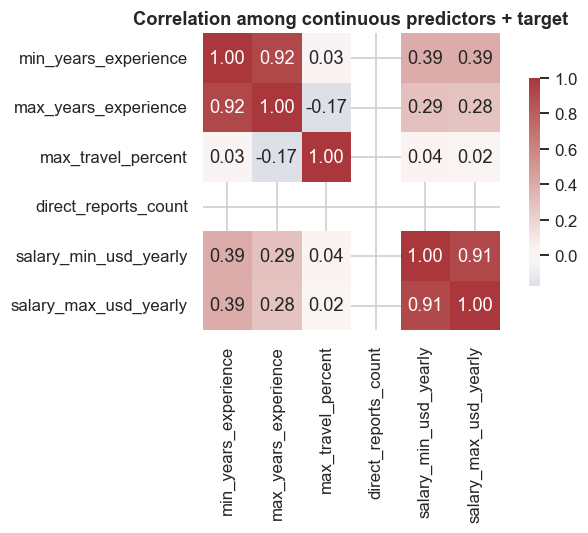
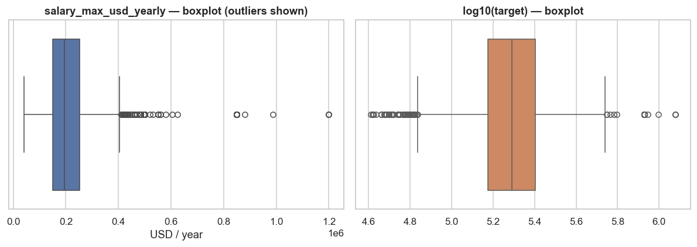

# EDA report — `data/curated/jobs.parquet`

_Auto-generated by `eda.audit`. 12,334 rows × 49 columns._

## 1. Headline

- **Target available**: 6,146 rows have `salary_max_usd_yearly` populated (49.8% of the curated table).
- **Median**: $195,000.0 / year.  P25/P75: $150,000.0 – $253,000.0.
- **Right-skewed**: skew=+2.49, kurtosis=+16.01. After log10, skew=-0.25 (much more symmetric — train on log).
- **Disclosure bias is the dominant data-quality concern** (Section 9).
- **Geographic skew**: ~95% US / ~5% CA. CA model performance will be unreliable on small n.
- **Provider mix**: Greenhouse dominates (~86%); Workday is missing entirely (Phase 4 lift).

## 2. Schema + dtype classification

Columns by role:

- **nominal**: 13
- **metadata**: 10
- **boolean**: 7
- **continuous**: 5
- **datetime**: 4
- **ordinal**: 4
- **list**: 3
- **text**: 2
- **target**: 1

Per-column breakdown (click to expand)

| column                      | role       | dtype                           |   fill_rate |   n_unique |
|:----------------------------|:-----------|:--------------------------------|------------:|-----------:|
| salary_disclosed            | boolean    | bool                            |      1      |          2 |
| offers_equity               | boolean    | boolean                         |      0.6485 |          1 |
| bonus_mentioned             | boolean    | boolean                         |      0.3629 |          1 |
| requires_security_clearance | boolean    | boolean                         |      0.098  |          1 |
| offers_relocation           | boolean    | boolean                         |      0.0498 |          2 |
| on_call_required            | boolean    | boolean                         |      0.0428 |          1 |
| offers_visa_sponsorship     | boolean    | object                          |      0.0035 |          1 |
| min_years_experience        | continuous | float64                         |      0.818  |         18 |
| salary_min_usd_yearly       | continuous | float64                         |      0.4983 |        836 |
| max_travel_percent          | continuous | float64                         |      0.0646 |         15 |
| max_years_experience        | continuous | float64                         |      0.0406 |         12 |
| direct_reports_count        | continuous | float64                         |      0.0001 |          1 |
| scraped_at                  | datetime   | datetime64[us, America/Toronto] |      1      |         65 |
| first_seen_at               | datetime   | datetime64[us]                  |      1      |          1 |
| last_seen_at                | datetime   | datetime64[us]                  |      1      |          1 |
| posted_at                   | datetime   | datetime64[us, America/Toronto] |      0.8611 |      10532 |
| tech_stack                  | list       | object                          |      0.6473 |       1619 |
| requires_citizenship        | list       | object                          |      0.1405 |          3 |
| language_requirements       | list       | object                          |      0.0216 |         10 |
| id                          | metadata   | object                          |      1      |      12334 |
| company_name                | metadata   | object                          |      1      |         65 |
| url                         | metadata   | object                          |      1      |      12334 |
| location_raw                | metadata   | object                          |      1      |       1235 |
| raw_payload_hash            | metadata   | object                          |      1      |      12334 |
| extraction_meta             | metadata   | object                          |      1      |       3038 |
| extraction_version          | metadata   | object                          |      1      |          1 |
| times_seen                  | metadata   | int64                           |      1      |          1 |
| salary_min                  | metadata   | float64                         |      0.4983 |        755 |
| salary_max                  | metadata   | float64                         |      0.4983 |        828 |
| company_slug                | nominal    | object                          |      1      |         65 |
| country                     | nominal    | object                          |      1      |          2 |
| role_family_extracted       | nominal    | object                          |      1      |          8 |
| source                      | nominal    | object                          |      1      |          3 |
| posting_quality             | nominal    | object                          |      1      |          3 |
| city                        | nominal    | object                          |      0.8108 |        397 |
| equity_form                 | nominal    | object                          |      0.6485 |          3 |
| region                      | nominal    | object                          |      0.578  |         47 |
| salary_period               | nominal    | object                          |      0.5452 |          3 |
| salary_currency             | nominal    | object                          |      0.4983 |          2 |
| remote_policy               | nominal    | object                          |      0.4471 |          3 |
| contract_type               | nominal    | object                          |      0.3436 |          5 |
| bonus_type                  | nominal    | object                          |      0.0585 |          3 |
| seniority_extracted         | ordinal    | object                          |      1      |          8 |
| manager_role                | ordinal    | object                          |      0.2551 |          5 |
| min_education               | ordinal    | object                          |      0.2516 |          5 |
| clearance_level             | ordinal    | object                          |      0.098  |          4 |
| salary_max_usd_yearly       | target     | float64                         |      0.4983 |        899 |
| title                       | text       | object                          |      1      |       8914 |
| description_md              | text       | object                          |      1      |      11596 |

## 3. Univariate distributions

Continuous predictors:

Categorical predictors (top 8 levels each):

## 4. Missingness analysis

Top 15 most-missing columns:

|                             |   % missing |
|:----------------------------|------------:|
| direct_reports_count        |       100   |
| offers_visa_sponsorship     |        99.7 |
| language_requirements       |        97.8 |
| max_years_experience        |        95.9 |
| on_call_required            |        95.7 |
| offers_relocation           |        95   |
| bonus_type                  |        94.2 |
| max_travel_percent          |        93.5 |
| clearance_level             |        90.2 |
| requires_security_clearance |        90.2 |
| requires_citizenship        |        85.9 |
| min_education               |        74.8 |
| manager_role                |        74.5 |
| contract_type               |        65.6 |
| bonus_mentioned             |        63.7 |

### MAR / MNAR diagnostics

Chi-square test: does **missingness in column X** depend on the value of column Y? If `p_value < 0.05`, missingness is **not random** w.r.t. Y (i.e. **MAR**, missing-at-random conditional on observed predictors). If no dependency is detected anywhere we lean towards **MCAR**; if missingness clearly correlates with values we'd expect it to depend on (e.g. salary missingness depends on country), that's diagnostic of MAR.

**Salary disclosure is almost certainly MNAR** — the choice to disclose is made by the employer and depends on the unobserved actual salary level (companies in highly-paying buckets disclose less unless legally required). The chi-square table can only show MAR-like associations with observed columns; the MNAR component remains a modelling concern that we address via stratified eval and an honest model-card framing.

| missing_column        | vs                    |    chi2 |   p_value | interpretation                             |
|:----------------------|:----------------------|--------:|----------:|:-------------------------------------------|
| min_years_experience  | country               |    1.81 |  0.178128 | no detectable dependency                   |
| min_years_experience  | source                |  243.47 |  0        | MAR-like (missingness depends on observed) |
| min_years_experience  | role_family_extracted |  365.29 |  0        | MAR-like (missingness depends on observed) |
| min_years_experience  | seniority_extracted   |  345.43 |  0        | MAR-like (missingness depends on observed) |
| min_education         | country               |   41.6  |  0        | MAR-like (missingness depends on observed) |
| min_education         | source                |  321.98 |  0        | MAR-like (missingness depends on observed) |
| min_education         | role_family_extracted |  173.24 |  0        | MAR-like (missingness depends on observed) |
| min_education         | seniority_extracted   |  118.18 |  0        | MAR-like (missingness depends on observed) |
| salary_max_usd_yearly | country               |    5.51 |  0.018921 | MAR-like (missingness depends on observed) |
| salary_max_usd_yearly | source                | 1041.15 |  0        | MAR-like (missingness depends on observed) |
| salary_max_usd_yearly | role_family_extracted |   41.12 |  1e-06    | MAR-like (missingness depends on observed) |
| salary_max_usd_yearly | seniority_extracted   |  216.67 |  0        | MAR-like (missingness depends on observed) |
| remote_policy         | country               |  328.5  |  0        | MAR-like (missingness depends on observed) |
| remote_policy         | source                |  935.01 |  0        | MAR-like (missingness depends on observed) |
| remote_policy         | role_family_extracted |  208.4  |  0        | MAR-like (missingness depends on observed) |
| remote_policy         | seniority_extracted   |  205.74 |  0        | MAR-like (missingness depends on observed) |

## 5. Target deep-dive

`salary_max_usd_yearly`: n=6,146, mean $210,758.0, median $195,000.0, std $91,765.0.

- Percentiles: P10 $115,000.0, P25 $150,000.0, P75 $253,000.0, P90 $305,525.0, P99 $485,000.0
- Skew: raw +2.49 → log -0.25
- Kurtosis: raw +16.01 → log +1.07

**Recommendation**: train the regressor on `log10(target)`; report MAE in USD via back-transform. Symmetric residuals + better-behaved tails for tree-based models.

Stratified by country / source / role / seniority:

## 6. Bivariate (target vs predictors)

**Continuous predictors vs target** (Pearson + Spearman correlation, ranked by |Spearman|):

| predictor             |    n |   pearson |   spearman |
|:----------------------|-----:|----------:|-----------:|
| salary_min_usd_yearly | 6146 |     0.912 |      0.933 |
| min_years_experience  | 5262 |     0.392 |      0.546 |
| max_years_experience  |  236 |     0.277 |      0.346 |
| max_travel_percent    |  500 |     0.016 |      0.069 |

**Categorical predictors vs target** (one-way ANOVA F-test across groups; small p-value ⇒ group means differ):

| predictor             |    n |   groups |   anova_f |   p_value |
|:----------------------|-----:|---------:|----------:|----------:|
| min_education         | 1845 |        5 |    105.92 |  0        |
| seniority_extracted   | 6146 |        8 |    128.57 |  0        |
| manager_role          | 1601 |        5 |     78.77 |  0        |
| country               | 6146 |        2 |    106.5  |  0        |
| region                | 4803 |       29 |      8.97 |  0        |
| city                  | 4788 |       65 |     31.52 |  0        |
| role_family_extracted | 6146 |        8 |    115.98 |  0        |
| contract_type         | 2685 |        3 |     76.15 |  0        |
| equity_form           | 5644 |        3 |    180.61 |  0        |
| bonus_type            |  691 |        3 |    124.7  |  0        |
| salary_currency       | 6146 |        2 |    202.05 |  0        |
| salary_period         | 6146 |        3 |    366.83 |  0        |
| company_slug          | 6146 |       45 |     80.59 |  0        |
| source                | 6146 |        3 |     13.97 |  1e-06    |
| remote_policy         | 2541 |        3 |      3.33 |  0.03589  |
| clearance_level       | 1155 |        3 |      0.65 |  0.520244 |

**Boolean predictors vs target** (Welch t-test on yes/no medians):

| predictor                   |   n_yes |   n_no |   median_yes |   median_no |   t_stat |   p_value |
|:----------------------------|--------:|-------:|-------------:|------------:|---------:|----------:|
| offers_equity               |    5644 |    502 |       200000 |      145733 |    15.86 |  0        |
| bonus_mentioned             |    3203 |   2943 |       200000 |      194000 |     5.45 |  0        |
| on_call_required            |     220 |   5926 |       219200 |      195000 |     1.83 |  0.068369 |
| offers_relocation           |     168 |   5978 |       200000 |      195000 |    -1.14 |  0.254525 |
| requires_security_clearance |    1155 |   4991 |       213000 |      195000 |    -0.87 |  0.382173 |

## 7. Multicollinearity

VIF on continuous predictors (rule of thumb: VIF > 5 ⇒ moderate, > 10 ⇒ severe multicollinearity):

| predictor             |   vif |
|:----------------------|------:|
| min_years_experience  |  4.24 |
| salary_min_usd_yearly |  4.24 |

**Condition number** of the design matrix (1 + continuous block): `468030.2`. > 30 hints at multicollinearity; > 100 is severe.

Note: ordinal / nominal predictors must be encoded before VIF is meaningful for them. We'll redo this on the full one-hot design matrix in the modelling step.

## 8. Outliers

| predictor             |     n |   min |       max |   iqr_low_fence |   iqr_high_fence |   n_iqr_outliers |   n_z_above_3 |
|:----------------------|------:|------:|----------:|----------------:|-----------------:|-----------------:|--------------:|
| min_years_experience  | 10089 |     1 | 25        |            -4.5 |             15.5 |               71 |            71 |
| max_years_experience  |   501 |     2 | 15        |             0.5 |             12.5 |               15 |             0 |
| max_travel_percent    |   797 |     0 | 80        |           -10   |             70   |               26 |            15 |
| direct_reports_count  |     1 |     6 |  6        |             6   |              6   |                0 |             0 |
| salary_min_usd_yearly |  6146 |     1 |  1.02e+06 |         -3250   |         307550   |              188 |            67 |

**Sanity checks** worth performing manually before training:
- Hourly-rate postings (salary_period=`hour`) should annualize plausibly. We multiply by 2080 (40 h × 52 wk) which biases part-time gigs upward; tree-based models should handle this.
- Anything below ~$30k/yr USD-equivalent is likely a stipend or part-time misclassification.
- Anything above ~$1M/yr is likely a typo, total-comp including unvested equity, or a C-suite role; consider winsorizing at the 99.5th percentile.

## 9. Bias, omitted-variable risk, transformation recs

### Selection / disclosure bias (the big one)

Only ~50% of NA tech postings disclose salary — and disclosure is **not random**:

- **Geographic mandate**: California, NYC, Washington, Colorado, Connecticut, Maryland, Illinois and Hawaii (US) plus Ontario, BC and PEI (CA) require disclosure on postings in their jurisdictions. Roles primarily based outside these are systematically less likely to disclose ⇒ *region-conditional MAR*.
- **Company policy**: high-disclosure companies (Stripe, Anduril, Cohere, Anthropic) over-represent the disclosed sample; low-disclosure companies (most defense / non-listed) are under-represented.
- **Salary-conditional self-selection (MNAR)**: within a non-mandated jurisdiction, companies offering above-market or below-market pay disclose at different rates than the modal mid-pay company. We can't observe this directly.

**Implications for modelling**:
1. The model predicts salary *as a disclosing company in our corpus would price the role*. State this explicitly in the model card.
2. Stratified eval: report MAE / MAPE separately by country and source so the residual bias inside the disclosing pool is visible.
3. Consider a 2-stage model later: P(disclosed | features) + E[salary | disclosed, features]. Phase 2 ships only the second stage; Phase 4+ can revisit.

### Omitted-variable risks

- **No company-size / valuation feature**: salary correlates strongly with whether a company is post-IPO, late-stage private, or pre-Series-B. We can't infer this from the ATS payload, so the model implicitly attributes that variation to `company_slug` (high-cardinality, leaky).
- **No 'years since founded' / 'industry vertical' beyond what title regex catches**.
- **No total-comp breakdown** (base vs equity vs bonus). Some Bay Area roles disclose only base — others disclose total. We can't distinguish without text mining the description.

### Transformation recommendations (for Step 3 modelling)

| Predictor | Transform |
|---|---|
| `salary_max_usd_yearly` (target) | `log10` (raw is right-skewed) |
| `country` | one-hot (only 2 levels — `US`, `CA`) |
| `region` (~30 distinct values) | target encode with k-fold leakage protection |
| `source` | one-hot |
| `role_family_extracted` (9 levels) | one-hot |
| `seniority_extracted` (9 ordinal levels) | integer encode (preserves order) |
| `min_education` (5 ordinal levels) | integer encode |
| `min_years_experience` | keep raw + add `is_missing` indicator |
| `remote_policy` | one-hot, with `<missing>` as its own level |
| Boolean fields with `boolean` dtype | impute False → 0; missingness mask separately |
| `tech_stack` (list of str) | top-N indicator columns OR count |
| `posted_at` | derive `days_since_posted`, drop the raw timestamp |
| `company_slug` | **don't** one-hot directly (~65 levels, leaky); target-encode with k-fold |

### Multicollinearity hot spots

Already-known sources of redundancy we'll guard against:
- `salary_min_usd_yearly` vs `salary_max_usd_yearly` (corr ≈ 0.95) — drop min from the input.
- `min_years_experience` vs `seniority_extracted` (likely Spearman > 0.5) — keep both, tree-based models handle the redundancy fine.
- `manager_role` and `seniority_extracted` (manager/director appear in both) — overlap expected; we'll re-check VIF on the full encoded matrix.

## 10. What this means for Step 3 (modelling)

1. **Train target**: `log10(salary_max_usd_yearly)` on the disclosed subset.
2. **Stratified eval**: report MAE / MAPE / R² broken out by `country` and `source`.
3. **Honest framing in the model card**: the model predicts salary as priced by disclosing employers in this corpus — _not_ ground truth.
4. **Drop**: `salary_min_*` from inputs (information leak). `id`, `url`, `description_md` are not used as tabular features (description goes through bge-m3 in Phase 5; for Phase 2's first regressor we keep tabular only).
5. **Handle**: high-cardinality `region` and `company_slug` via target encoding with k-fold leakage protection.
6. **Don't use** anything still 0%-fill (industry_experience, team_or_department, direct_reports_count, max_years_experience). Revisit in Phase 4+ when LLM tier is enabled or DeBERTa classifiers replace the title-regex heuristics.

